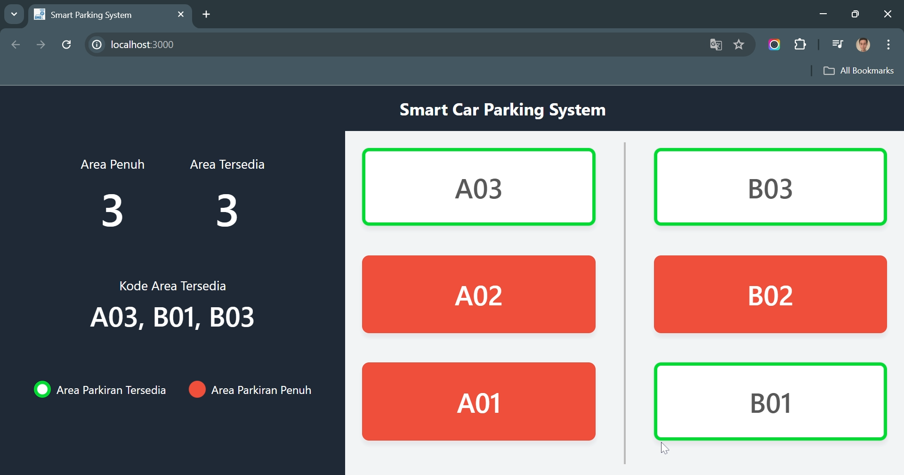

# Smart Parking System

This project aims to provide real-time parking availability information using IoT technology and Firebase.

## Key Features

- **Real-time Parking Data:**
  Users can view the number of occupied and available parking areas, as well as the available parking area codes.

- **Local Storage:**
  Initial parking data is loaded from local storage for a better user experience.

- **Responsive UI:**
  A responsive user interface using Tailwind CSS.

## Usage

The application will automatically update parking data based on changes in Firestore. When parking areas become full or available, the user interface will be updated in real-time.

Here is the main view provided by this application:

### Main View

- **Full Areas:** Displays the number of full parking areas.
- **Available Areas:** Displays the number of available parking areas.
- **Available Area Codes:** Displays the codes for available parking areas.

## Prototype Demonstration

Check out the video demonstration of the prototype: (https://s.id/smart-parking).

## Contribution

We welcome contributions from the community. If you would like to contribute to this project, please open a new issue or submit a pull request after making changes.

## License

This project is licensed under the MIT License. See the [LICENSE](./LICENSE) file for details.

## Contact

For further questions or technical support, please contact us at [falihrahmat534@gmail.com](mailto:falihrahmat534@gmail.com).

